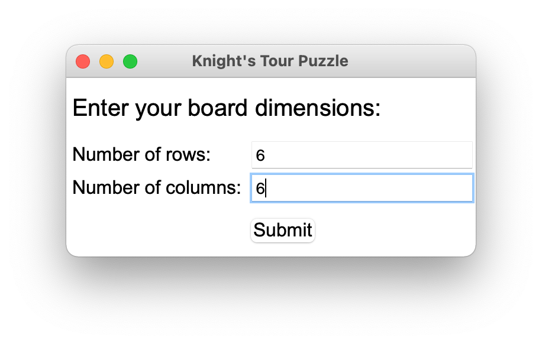
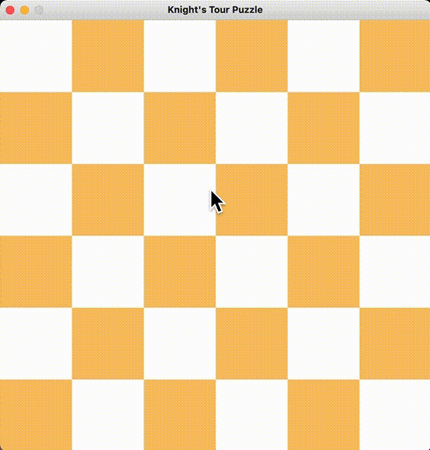
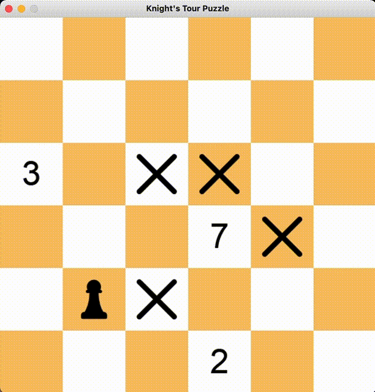

# Knight's Tour Puzzle

## About
The Knight’s Tour is a fun puzzle where you move the knight so that it visits every square of the chessboard once. 

## Rules
The knight is a chess piece. It moves in an L-shape and can jump over other pieces. It has to move 2 squares horizontally and 1 square vertically, or 2 squares vertically and 1 square horizontally.

- The knight can start at any square.
- The knight must visit every square by moving in the L-shape.
- The knight can visit each square only once.
- The knight can finish anywhere on the board. This is called an 'open' tour of the board.
- You win if you visit every square on the board.
- You lose if you fail to visit every square only once without revisiting it.


## Version
### Text version
Users will be asked three questions regarding puzzle dimensions, start position, and game mode (play or check solution).
####  Play the game:
```
Enter your board dimensions: 4 3
Enter the knight's starting position: 1 3
Do you want to try the puzzle? (y/n): y
 ---------------
3|  X __ __ __ |
2| __ __  1 __ |
1| __  2 __ __ |
 ---------------
    1  2  3  4
    
Enter your next move: 
```


#### Find the solution:

Solution is found using recursion. 
``` 
Enter your board dimensions: 4 3
Enter the knight's starting position: 1 3
Do you want to try the puzzle? (y/n): n
Here's the solution!
 ---------------
3|  1  4  7 10 |
2| 12  9  2  5 |
1|  3  6 11  8 |
 ---------------
    1  2  3  4
```
### GUI version
This version of game is built using pygame and tkinter modules. Users can play the game through mouse and keyboard.
By running the program:
1. Users will be asked to define the board dimension.

2. Board is then set up and users can play the game by clicking the squares. Next possible moves are presented with the count of the 2-step further moves.



3. Users can withdraw their last move by pressing `backspace`



## How to set up
To play text version:
- download [text-game.py](https://github.com/qilinz/Knights-Tour-Puzzle-Solver/blob/main/text-game.py) and [board.py](https://github.com/qilinz/Knights-Tour-Puzzle-Solver/blob/main/board.py)
- run [text-game.py](https://github.com/qilinz/Knights-Tour-Puzzle-Solver/blob/main/text-game.py)

To plat GUI version:
- download [GUI-game.py](https://github.com/qilinz/Knights-Tour-Puzzle-Solver/blob/main/GUI-game.py) and [grid.py](https://github.com/qilinz/Knights-Tour-Puzzle-Solver/blob/main/grid.py)
- run [GUI-game.py](https://github.com/qilinz/Knights-Tour-Puzzle-Solver/blob/main/GUI-game.py)


Disclaimer: The original project idea is from [JetBrains Academy](https://hyperskill.org/projects/141?track=2). I wrote all the codes by myself and advanced the project through adding a Graphic User Interface.